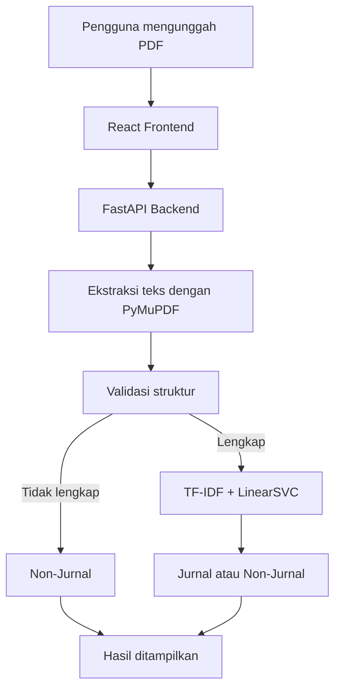

# Klasifikasi Dokumen Jurnal

Aplikasi web untuk mengklasifikasikan dokumen ilmiah (PDF) sebagai **Jurnal**
atau **Non-Jurnal** menggunakan pipeline hibrida dua tahap.

> **Catatan penting:** Sistem ini adalah prototipe pendukung keputusan
> administratif. Hasil **bukan** bukti resmi bahwa dokumen telah diterbitkan
> sebagai jurnal. Verifikasi publikasi resmi tetap memerlukan metadata seperti
> DOI, ISSN, penerbit, nama jurnal, volume, dan nomor terbitan.

---

## Cara Cepat Menjalankan (Quickstart)

Model sudah tersedia di `backend/artifacts/linearsvc_model.joblib`. Butuh **dua
terminal** — satu untuk backend, satu untuk frontend.

### 1. Backend (Terminal 1)

```bash
cd backend

# Buat virtual environment (lewati jika sudah ada folder .venv)
python -m venv .venv

# Aktivasi
.venv\Scripts\Activate.ps1        # Windows PowerShell
# .venv\Scripts\activate.bat      # Windows Command Prompt
# source .venv/bin/activate       # macOS / Linux

# Instal dependensi (lewati jika sudah terpasang)
pip install -r requirements.txt

# Jalankan server
uvicorn app.main:app --reload --port 8000
```

Cek `http://localhost:8000/api/v1/health` — harus `"model_loaded": true`.
Dokumentasi API interaktif: `http://localhost:8000/docs`.

### 2. Frontend (Terminal 2)

```bash
cd frontend/vite-project

npm install        # lewati jika sudah terpasang
npm run dev
```

Buka `http://localhost:5173` di browser. Selesai — unggah PDF atau tempel teks.

### Alternatif: Docker Compose

Satu perintah untuk backend + frontend sekaligus (model harus sudah ada di
`backend/artifacts/`):

```bash
docker compose up --build
```

- Backend: `http://localhost:8000`
- Frontend: `http://localhost:5173`

> Detail lengkap (environment variables, tes, penempatan model) ada di bagian
> di bawah.

---

## Tujuan Sistem

Membantu proses identifikasi awal apakah sebuah dokumen ilmiah menyerupai
artikel jurnal, berdasarkan **struktur dokumen** dan **pola teks**. Kualitas
hasil bergantung pada data pelatihan model.

## Klasifikasi Hibrida Dua Tahap

1. **Tahap 1 — Validasi Struktur (berbasis aturan).** Sistem memeriksa
   keberadaan empat bagian wajib: abstrak, metodologi, hasil, dan daftar
   pustaka. Jika satu saja tidak ditemukan, dokumen langsung dilabeli
   `non_jurnal` dan **model tidak dipanggil**.
2. **Tahap 2 — Klasifikasi Teks (TF-IDF + LinearSVC).** Hanya dokumen dengan
   struktur lengkap yang dianalisis oleh model scikit-learn terlatih.
   Label akhir ditentukan oleh `model.predict()`. Margin keputusan hanya
   ditampilkan sebagai diagnostik teknis — **bukan probabilitas**.

## Diagram Arsitektur



## Teknologi

**Backend:** Python 3.11+, FastAPI, Uvicorn, Pydantic, PyMuPDF, scikit-learn,
joblib, python-multipart, pytest.

**Frontend:** React (JavaScript, tanpa TypeScript), Vite, React Router, Axios,
Tailwind CSS, Lucide React, Vitest, React Testing Library, ESLint.

**Deployment:** Docker, Docker Compose. Tanpa database.

## Struktur Proyek

```
klasifikasi-dokumen-jurnal/
├── backend/
│   ├── app/
│   │   ├── api/          # routes_health, routes_documents, routes_texts, routes_model
│   │   ├── core/         # config, exceptions, logging
│   │   ├── schemas/      # classification, model, errors
│   │   ├── services/     # model_service, pdf_extractor, text_normalizer,
│   │   │                 # structure_detector, classification_service
│   │   └── main.py
│   ├── artifacts/        # linearsvc_model.joblib (tempatkan di sini)
│   ├── tests/
│   ├── requirements.txt
│   ├── .env.example
│   └── Dockerfile
├── frontend/
│   └── vite-project/     # aplikasi React (Vite)
│       ├── src/
│       ├── tests/
│       ├── package.json
│       └── Dockerfile
├── docker-compose.yml
├── README.md
├── .gitignore
└── sample.env
```

> **Catatan:** Proyek frontend berada pada `frontend/vite-project/`.

## Persyaratan

- Python 3.11 atau lebih baru
- Node.js 18 atau lebih baru + npm
- (Opsional) Docker & Docker Compose

## Penempatan Model

Model terlatih harus tersedia di `backend/artifacts/linearsvc_model.joblib`
sebelum menjalankan aplikasi. Jika model asli berada di
`artifacts_balanced/linearsvc_model.joblib`, salin sebagai berikut.

**Windows PowerShell:**

```powershell
Copy-Item `
  artifacts_balanced/linearsvc_model.joblib `
  backend/artifacts/linearsvc_model.joblib
```

**Windows Command Prompt:**

```cmd
copy artifacts_balanced\linearsvc_model.joblib backend\artifacts\linearsvc_model.joblib
```

> Jangan melatih ulang atau mengubah model yang disediakan. Aplikasi hanya
> memuat model, tidak pernah melatihnya.

## Environment Variables

**Backend** (`backend/.env`, contoh di `backend/.env.example`):

| Variabel | Default | Keterangan |
|----------|---------|------------|
| `MODEL_PATH` | `artifacts/linearsvc_model.joblib` | Lokasi model joblib |
| `MAX_UPLOAD_SIZE_MB` | `15` | Ukuran unggahan maksimum |
| `MIN_TEXT_LENGTH` | `300` | Panjang teks minimum untuk analisis |
| `CORS_ORIGINS` | `http://localhost:5173` | Asal yang diizinkan (dipisah koma) |
| `LOG_LEVEL` | `INFO` | Level logging |

**Frontend** (`frontend/vite-project/.env`):

| Variabel | Default |
|----------|---------|
| `VITE_API_BASE_URL` | `http://localhost:8000/api/v1` |

## Menjalankan Backend

```bash
cd backend

# Buat virtual environment
python -m venv .venv

# Aktivasi (Windows PowerShell)
.venv\Scripts\Activate.ps1
# Aktivasi (Windows Command Prompt)
.venv\Scripts\activate.bat

# Instal dependensi
python -m pip install --upgrade pip
pip install -r requirements.txt

# Jalankan server
uvicorn app.main:app --reload --port 8000
```

Backend berjalan di `http://localhost:8000`. Dokumentasi interaktif tersedia di
`http://localhost:8000/docs`.

## Menjalankan Frontend

```bash
cd frontend/vite-project
npm install
npm run dev
```

Frontend berjalan di `http://localhost:5173`.

## Menjalankan Tes

**Backend:**

```bash
cd backend
pytest
```

**Frontend:**

```bash
cd frontend/vite-project
npm run test    # Vitest
npm run lint    # ESLint
npm run build   # Build produksi
```

## Menjalankan dengan Docker Compose

Pastikan model sudah ditempatkan di `backend/artifacts/linearsvc_model.joblib`
terlebih dahulu, lalu:

```bash
docker compose up --build
```

- Backend: `http://localhost:8000`
- Frontend: `http://localhost:5173`

## Dokumentasi Endpoint API

Prefix: `/api/v1`

### `GET /health`

```json
{ "status": "ok", "model_loaded": true, "model_classes": ["jurnal", "non_jurnal"] }
```

Jika model tidak tersedia:

```json
{ "status": "degraded", "model_loaded": false, "model_classes": [] }
```

### `GET /model/info`

```json
{
  "name": "TF-IDF + LinearSVC",
  "task": "Klasifikasi jurnal dan non-jurnal",
  "classes": ["jurnal", "non_jurnal"],
  "required_structures": ["abstrak", "metodologi", "hasil", "daftar_pustaka"],
  "decision_margin_is_probability": false,
  "model_loaded": true
}
```

### `POST /documents/analyze`

`multipart/form-data`, field `file` (PDF, maks 15 MB).

Contoh respons — struktur tidak lengkap:

```json
{
  "filename": "dokumen.pdf",
  "final_label": "non_jurnal",
  "decision_stage": "validasi_struktur",
  "reason": "Dokumen tidak memenuhi seluruh struktur wajib.",
  "structures": {
    "abstrak": { "found": true, "matched_heading": "ABSTRAK", "excerpt": "ABSTRAK ..." },
    "metodologi": { "found": true, "matched_heading": "METODE PENELITIAN", "excerpt": "..." },
    "hasil": { "found": true, "matched_heading": "HASIL DAN PEMBAHASAN", "excerpt": "..." },
    "daftar_pustaka": { "found": false, "matched_heading": null, "excerpt": null }
  },
  "missing_structures": ["daftar_pustaka"],
  "text_length": 15420,
  "model": { "used": false, "predicted_label": null, "decision_margin": null }
}
```

Contoh respons — struktur lengkap:

```json
{
  "filename": "dokumen.pdf",
  "final_label": "jurnal",
  "decision_stage": "text_classification",
  "reason": "Dokumen memenuhi struktur wajib dan dianalisis menggunakan model TF-IDF dan LinearSVC.",
  "structures": { "...": "..." },
  "missing_structures": [],
  "text_length": 23650,
  "model": { "used": true, "predicted_label": "jurnal", "decision_margin": -0.4281 }
}
```

### `POST /texts/analyze`

```json
{ "text": "isi dokumen ilmiah..." }
```

Proses sama seperti analisis dokumen, tanpa unggahan berkas.

### Format Error

```json
{ "error": { "code": "INVALID_FILE_TYPE", "message": "File yang diunggah harus berformat PDF.", "details": null } }
```

Kode error: `INVALID_FILE_TYPE`, `FILE_TOO_LARGE`, `EMPTY_FILE`,
`PDF_EXTRACTION_FAILED`, `TEXT_TOO_SHORT`, `MODEL_UNAVAILABLE`,
`CLASSIFICATION_FAILED`, `VALIDATION_ERROR`, `INTERNAL_SERVER_ERROR`.

## Batasan yang Diketahui

- Sistem tidak membuktikan publikasi jurnal resmi.
- Belum mendukung OCR; PDF hasil pemindaian dapat gagal diekstrak dan akan
  mengembalikan error ekstraksi, **bukan** otomatis dilabeli non-jurnal.
- Kualitas prediksi bergantung pada data pelatihan.
- Margin keputusan bukan probabilitas.
- Model dapat membuat prediksi yang keliru.

## Troubleshooting

| Masalah | Solusi |
|---------|--------|
| `health` menampilkan `model_loaded: false` | Pastikan `backend/artifacts/linearsvc_model.joblib` ada dan `MODEL_PATH` benar. |
| Endpoint klasifikasi mengembalikan `MODEL_UNAVAILABLE` | Model belum dimuat; lihat log startup backend. |
| `InconsistentVersionWarning` saat memuat model | Model dilatih dengan scikit-learn 1.9.0. `requirements.txt` sudah menyematkan versi tersebut. |
| Error `TEXT_TOO_SHORT` pada PDF valid | Kemungkinan PDF hasil pemindaian (tanpa teks digital). OCR belum didukung. |
| CORS error di browser | Sesuaikan `CORS_ORIGINS` dengan asal frontend. |
| `Network Error` di frontend | Pastikan backend berjalan dan `VITE_API_BASE_URL` benar. |
