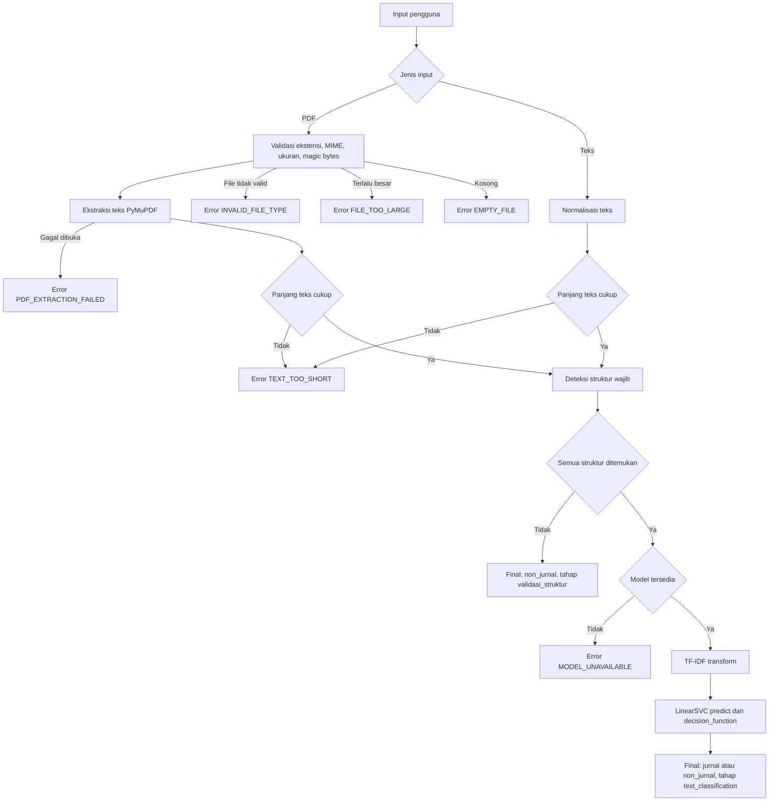
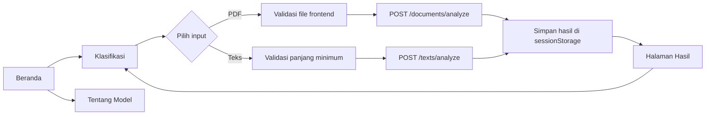
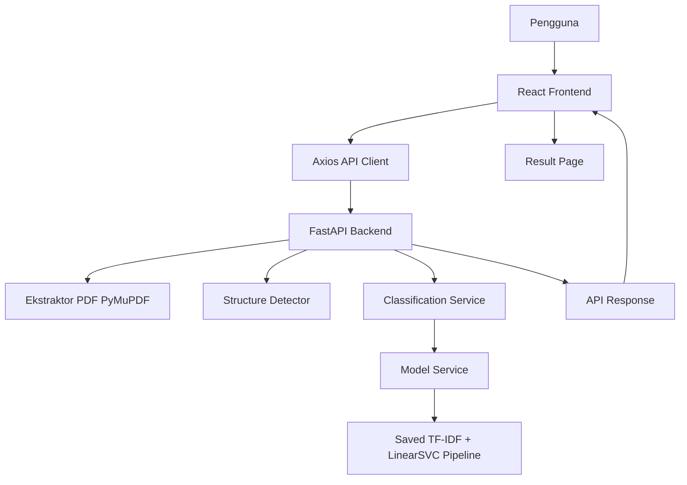
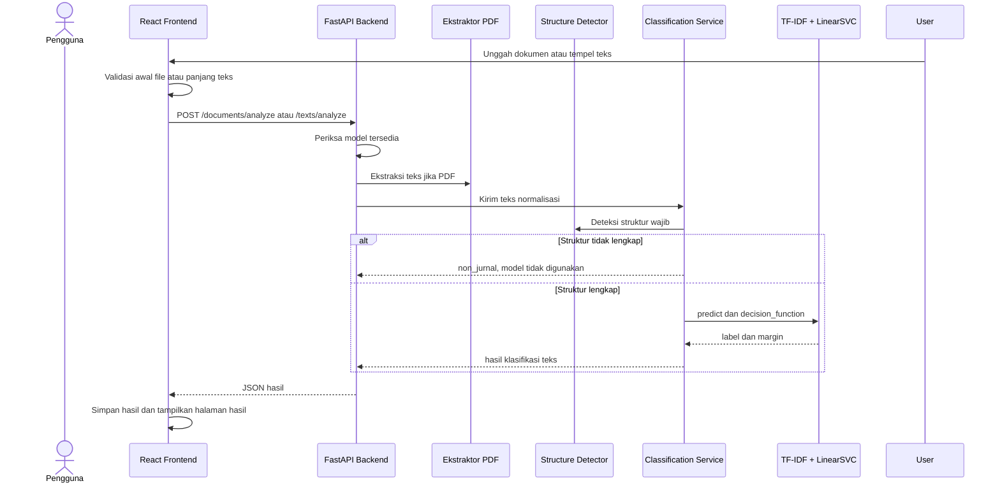

# INFORMASI LENGKAP SISTEM UNTUK PENYUSUNAN JURNAL

Dokumen ini disusun berdasarkan inspeksi repositori aplikasi klasifikasi dokumen jurnal pada 13 Juli 2026. Dokumen ini bukan artikel jurnal akhir, melainkan referensi faktual untuk membantu tim menyusun artikel akademik. Seluruh angka, perilaku sistem, dan konfigurasi yang ditulis sebagai fakta bersumber dari kode, konfigurasi, artefak model, README, atau hasil perintah verifikasi. Jika informasi tidak ditemukan, dokumen ini menggunakan pernyataan: "Informasi ini belum tersedia di dalam repositori dan perlu diverifikasi."

## 1. Ringkasan Eksekutif Sistem

Sistem ini adalah aplikasi web untuk membantu mengklasifikasikan dokumen ilmiah digital berformat PDF atau teks tempel sebagai `Jurnal` atau `Non-Jurnal`. Aplikasi menggunakan alur hibrida dua tahap: validasi struktur berbasis aturan, kemudian klasifikasi teks menggunakan pipeline TF-IDF dan LinearSVC apabila struktur wajib lengkap.

Sistem berperan sebagai prototipe pendukung keputusan administratif. Hasil sistem tidak membuktikan status publikasi jurnal resmi karena aplikasi tidak memverifikasi DOI, ISSN, penerbit, nama jurnal, volume, nomor terbitan, atau metadata publikasi resmi lain.

| Aspek | Informasi Terverifikasi |
|---|---|
| Nama sistem | Klasifikasi Dokumen Jurnal |
| Domain masalah | Klasifikasi dokumen ilmiah menjadi jurnal dan non-jurnal |
| Input | PDF digital melalui unggahan, atau teks dokumen melalui form teks |
| Output | Label akhir, tahap keputusan, alasan, status struktur, struktur hilang, panjang teks, status model, margin keputusan |
| Pendekatan | Hibrida dua tahap: rule-based structural validation dan text classification |
| Model | scikit-learn Pipeline: FeatureUnion TF-IDF kata dan karakter, kemudian LinearSVC |
| Frontend | React JavaScript, Vite, React Router, Axios, Tailwind CSS |
| Backend | FastAPI, PyMuPDF, scikit-learn, joblib |
| Status sistem | Prototipe aplikasi web tanpa database; model disediakan sebagai artefak joblib |

### Sumber Bukti dalam Repositori

- `README.md`
- `backend/app/services/classification_service.py`
- `backend/app/services/model_service.py`
- `backend/app/services/structure_detector.py`
- `backend/app/api/routes_documents.py`
- `backend/app/api/routes_texts.py`
- `frontend/package.json`
- `backend/artifacts/linearsvc_model.joblib`

## 2. Latar Belakang Masalah

### Konteks Faktual Sistem

Repositori menunjukkan bahwa sistem dibuat untuk membantu identifikasi awal dokumen ilmiah yang menyerupai artikel jurnal. Kode dan README menekankan bahwa dokumen harus memiliki empat struktur wajib: abstrak, metodologi, hasil, dan daftar pustaka. Dokumen yang tidak memiliki salah satu struktur tersebut langsung diberi label `non_jurnal` pada tahap validasi struktur.

Struktur saja tidak menjadi satu-satunya dasar untuk dokumen yang lengkap. Jika struktur wajib lengkap, sistem melanjutkan analisis ke model TF-IDF dan LinearSVC. Hal ini menunjukkan bahwa implementasi memisahkan pemeriksaan kelengkapan struktur dari penilaian pola teks.

### Interpretasi yang Masuk Akal

Pendekatan dua tahap sesuai untuk prototipe ini karena tahap pertama memberikan keputusan yang mudah dijelaskan untuk dokumen tidak lengkap, sedangkan tahap kedua menangani dokumen yang secara struktur memenuhi syarat tetapi tetap perlu dibedakan berdasarkan pola teks.

### Hal yang Memerlukan Referensi Ilmiah Eksternal

- Efektivitas TF-IDF untuk klasifikasi teks.
- Kesesuaian LinearSVC untuk fitur teks berdimensi tinggi dan sparse.
- Keunggulan dan keterbatasan metode klasifikasi hibrida.
- Pendekatan deteksi struktur dokumen ilmiah.
- Penelitian terdahulu tentang klasifikasi dokumen ilmiah.
- Konteks administratif repositori dokumen ilmiah di perguruan tinggi.

### Sumber Bukti dalam Repositori

- `README.md`
- `backend/app/services/classification_service.py`
- `frontend/src/pages/ModelInfoPage.jsx`
- `frontend/src/utils/constants.js`

## 3. Rumusan Masalah yang Dapat Digunakan

Rumusan berikut adalah usulan formulasi penelitian, bukan kutipan langsung dari kode.

1. Bagaimana validasi struktur berbasis aturan dapat digunakan untuk mengidentifikasi dokumen ilmiah yang tidak memenuhi struktur minimum artikel jurnal?
2. Bagaimana model TF-IDF dan LinearSVC mengklasifikasikan teks dokumen ilmiah yang telah memenuhi struktur wajib?
3. Bagaimana alur hibrida dua tahap menggabungkan validasi struktur dan klasifikasi teks dalam sistem klasifikasi jurnal dan non-jurnal?
4. Bagaimana kinerja model pada data evaluasi yang tersedia di repositori?
5. Bagaimana implementasi aplikasi berbasis React dan FastAPI mendukung proses klasifikasi dokumen?
6. Apa keterbatasan sistem dalam membedakan dokumen jurnal dan non-jurnal, terutama pada dokumen yang mirip secara struktur dan gaya penulisan?

### Sumber Bukti dalam Repositori

- `README.md`
- `backend/app/services/classification_service.py`
- `backend/app/services/model_service.py`
- `frontend/src/pages/ModelInfoPage.jsx`

## 4. Tujuan Penelitian yang Dapat Digunakan

### Tujuan Utama

Mengembangkan dan mengevaluasi prototipe sistem klasifikasi dokumen ilmiah berbasis validasi struktur dan klasifikasi teks untuk membantu identifikasi awal dokumen jurnal dan non-jurnal.

### Tujuan Khusus

1. Mendeskripsikan implementasi validasi struktur dokumen berdasarkan keberadaan abstrak, metodologi, hasil, dan daftar pustaka.
2. Mendeskripsikan penggunaan pipeline TF-IDF dan LinearSVC untuk klasifikasi teks dokumen yang lolos validasi struktur.
3. Menguji fungsi backend dan frontend melalui pengujian otomatis yang tersedia.
4. Mengidentifikasi batasan sistem berdasarkan kode, artefak model, dan konfigurasi.
5. Menghitung metrik evaluasi model apabila dataset evaluasi dan artefak metrik tersedia. Saat inspeksi, artefak evaluasi tidak tersedia.

### Sumber Bukti dalam Repositori

- `backend/tests/`
- `frontend/tests/`
- `backend/artifacts/linearsvc_model.joblib`
- `README.md`

## 5. Manfaat Sistem dan Penelitian

Sistem dapat membantu program studi, pengelola repositori, atau staf administrasi melakukan penyaringan awal dokumen ilmiah. Mahasiswa dan peneliti dapat menggunakan sistem sebagai alat bantu pemeriksaan struktur dokumen, bukan sebagai bukti publikasi. Pengembang lanjutan dapat menggunakan arsitektur API, pemisahan frontend-backend, dan pipeline model tersimpan sebagai dasar pengembangan berikutnya.

Manfaat tersebut harus ditulis secara hati-hati karena repositori belum menyediakan data uji pengguna, studi dampak administratif, atau evaluasi penerapan nyata.

### Sumber Bukti dalam Repositori

- `README.md`
- `frontend/src/pages/HomePage.jsx`
- `frontend/src/pages/ModelInfoPage.jsx`

## 6. Ruang Lingkup dan Batasan

| Aspek | Cakupan | Batasan |
|---|---|---|
| Jenis input | PDF digital dan teks tempel | Tidak ditemukan dukungan DOCX, gambar, atau URL |
| Ukuran berkas | Maksimum 15 MB | Nilai dapat diubah melalui `MAX_UPLOAD_SIZE_MB` |
| Ekstraksi PDF | PyMuPDF, halaman demi halaman | OCR tidak tersedia |
| PDF hasil pindai | Dapat diproses hanya jika mengandung teks digital | Jika teks tidak cukup, sistem mengembalikan `TEXT_TOO_SHORT` atau `PDF_EXTRACTION_FAILED` |
| Struktur wajib | Abstrak, metodologi, hasil, daftar pustaka | Jika satu struktur hilang, sistem memberi label `non_jurnal` tanpa memanggil model |
| Label | `jurnal`, `non_jurnal` | Tidak ada subkelas jenis dokumen lain |
| Bahasa | Varian heading Indonesia dan Inggris didukung | Bahasa dataset pelatihan tidak tersedia di repositori |
| Input model | Teks hasil normalisasi ringan | Training dataset tidak tersedia untuk audit lengkap |
| Evaluasi model | Tidak ada file metrik atau confusion matrix | Nilai akurasi, precision, recall, dan F1 belum tersedia di repositori |
| DOI/ISSN | Tidak diverifikasi | Sistem bukan verifikator publikasi resmi |
| Database | Tidak ditemukan database | Riwayat analisis tidak disimpan di backend |
| Penyimpanan sementara | File PDF ditulis ke temporary file lalu dihapus | Tidak ada audit log dokumen |
| Margin keputusan | Ditampilkan sebagai diagnostik | Bukan probabilitas atau persentase keyakinan |

### Sumber Bukti dalam Repositori

- `backend/app/core/config.py`
- `backend/app/services/pdf_extractor.py`
- `backend/app/services/classification_service.py`
- `backend/app/services/structure_detector.py`
- `frontend/src/utils/constants.js`

## 7. Definisi Operasional

- Jurnal: label `jurnal` yang dihasilkan oleh model untuk dokumen yang lolos validasi struktur dan diprediksi oleh pipeline LinearSVC sebagai kelas jurnal.
- Non-jurnal: label `non_jurnal` yang dapat berasal dari kegagalan validasi struktur atau prediksi model.
- Dokumen karya ilmiah: dokumen yang dianalisis sistem melalui PDF digital atau teks.
- Format sesuai: dokumen yang memiliki empat struktur wajib.
- Format tidak sesuai: dokumen yang kehilangan minimal satu struktur wajib.
- Validasi struktur: pemeriksaan rule-based terhadap heading abstrak, metodologi, hasil, dan daftar pustaka.
- Klasifikasi teks: prediksi label menggunakan pipeline TF-IDF dan LinearSVC.
- Rule-based classification: keputusan berdasarkan aturan struktur tanpa pembelajaran mesin.
- TF-IDF: representasi teks menjadi fitur numerik berbasis bobot istilah.
- LinearSVC: model Support Vector Machine linear dari scikit-learn.
- Hybrid two-stage classification: alur yang menggabungkan validasi struktur dan klasifikasi teks.
- Decision margin: nilai dari `decision_function()` yang bersifat diagnostik dan bukan probabilitas.
- PDF digital: PDF yang berisi teks yang dapat diekstrak PyMuPDF.
- Ekstraksi teks: proses mengambil teks dari setiap halaman PDF.

Dokumen yang kehilangan satu struktur wajib langsung diberi label `non_jurnal` pada tahap validasi struktur. Dokumen yang strukturnya lengkap dikirim ke model. Prediksi model tidak membuktikan status publikasi jurnal resmi.

### Sumber Bukti dalam Repositori

- `backend/app/services/classification_service.py`
- `backend/app/services/model_service.py`
- `frontend/src/utils/constants.js`
- `README.md`

## 8. Metodologi Penelitian yang Sesuai

Alur penelitian dapat disusun menggunakan kerangka CRISP-DM karena tahapan implementasi yang ditemukan memiliki kesesuaian dengan proses data mining, tetapi repositori tidak menyatakan bahwa CRISP-DM secara formal digunakan saat pengembangan.

| Tahap CRISP-DM | Aktivitas yang Terlihat | Bukti | Output | Informasi Hilang |
|---|---|---|---|---|
| Business Understanding | Tujuan membantu identifikasi awal dokumen jurnal/non-jurnal | `README.md` | Tujuan sistem dan batasan | Kebutuhan pengguna formal |
| Data Understanding | Tidak tersedia dataset pelatihan atau metadata data | Tidak ditemukan `data/` atau CSV dataset | Tidak dapat diaudit | Asal data, jumlah data, distribusi kelas |
| Data Preparation | Tidak tersedia script persiapan data | Tidak ditemukan training/data script | Tidak dapat direkonstruksi | Pembersihan data, filter, duplicate handling |
| Modeling | Pipeline model tersimpan tersedia | `backend/artifacts/linearsvc_model.joblib` | TF-IDF word + char, LinearSVC | Script pelatihan tidak tersedia |
| Evaluation | Tes aplikasi tersedia; metrik model tidak tersedia | `backend/tests/`, `frontend/tests/` | 30 tes backend dan 14 tes frontend lulus | Akurasi, F1, confusion matrix |
| Deployment | Backend FastAPI, frontend Vite, konfigurasi lokal | `README.md`, `sample.env` | Instruksi runtime lokal | Informasi deployment produksi |

### Sumber Bukti dalam Repositori

- `README.md`
- `backend/artifacts/linearsvc_model.joblib`
- `backend/tests/`
- `frontend/tests/`

## 9. Arsitektur Klasifikasi Dua Tahap

Tahap pertama menerima input, memvalidasi file jika input berupa PDF, mengekstrak teks, memeriksa panjang teks minimum, lalu mendeteksi struktur wajib. Jika struktur tidak lengkap, hasil akhir adalah `non_jurnal` dan model tidak dipanggil. Tahap kedua hanya berjalan apabila struktur lengkap. Teks dinormalisasi ringan, ditransformasikan oleh TF-IDF yang sudah tersimpan, diprediksi oleh LinearSVC, dan margin keputusan diambil sebagai informasi teknis.



| Kondisi Struktur | Model Dipanggil | Hasil Tahap | Hasil Akhir |
|---|---:|---|---|
| Minimal satu struktur wajib hilang | Tidak | `validasi_struktur` | `non_jurnal` |
| Semua struktur wajib ditemukan | Ya | `text_classification` | Label dari `model.predict()` |
| Model tidak tersedia | Tidak | Error | `MODEL_UNAVAILABLE` |
| Teks terlalu pendek | Tidak | Error | `TEXT_TOO_SHORT` |

### Sumber Bukti dalam Repositori

- `backend/app/api/routes_documents.py`
- `backend/app/api/routes_texts.py`
- `backend/app/services/pdf_extractor.py`
- `backend/app/services/classification_service.py`
- `backend/app/services/model_service.py`

## 10. Analisis Validasi Struktur

Detektor struktur menggunakan regex yang di-anchor di awal baris dengan `re.MULTILINE` dan `re.IGNORECASE`. Heading dapat diawali nomor, angka Romawi, atau prefiks `BAB`. Teks dinormalisasi hanya pada line ending sebelum deteksi. Pencegahan false positive dilakukan dengan pencocokan di awal baris dan boundary kata, sehingga kata seperti "hasil" di tengah paragraf tidak dihitung sebagai heading.

| Struktur | Variasi Judul yang Didukung | Metode Deteksi | Potensi Kegagalan |
|---|---|---|---|
| Abstrak | `abstrak`, `abstract` | Regex awal baris, case-insensitive | Heading tidak berada di awal baris atau menggunakan sinonim tidak terdaftar |
| Metodologi | `metode penelitian dan pengembangan`, `metode penelitian`, `metode dan bahan`, `bahan dan metode`, `materials and methods`, `research methodology`, `research methods`, `research method`, `methodology`, `methods`, `method`, `metodologi`, `metode` | Regex awal baris dengan dukungan nomor/BAB | Heading kreatif atau campuran bahasa yang tidak ada dalam daftar |
| Hasil | `hasil dan pembahasan`, `pembahasan dan hasil`, `results and discussion`, `findings and discussion`, `hasil penelitian`, `findings`, `results`, `result`, `temuan`, `hasil` | Regex awal baris | Bagian hasil yang tidak ditulis sebagai heading eksplisit |
| Daftar Pustaka | `daftar pustaka`, `bibliography`, `references`, `referensi`, `rujukan` | Regex awal baris | Daftar referensi dengan judul lain |

Kutipan yang dikembalikan memiliki panjang maksimum 160 karakter dari posisi heading, kemudian whitespace diringkas menjadi satu baris.

### Sumber Bukti dalam Repositori

- `backend/app/services/structure_detector.py`
- `backend/tests/test_structure_detector.py`

## 11. Ekstraksi dan Normalisasi Teks

Ekstraksi PDF menggunakan PyMuPDF (`fitz`). Konten unggahan ditulis ke temporary file dengan suffix `.pdf`, dibuka dengan `fitz.open()`, lalu setiap halaman diekstrak menggunakan `page.get_text("text")`. File sementara dihapus dalam blok `finally`.

Normalisasi teks meliputi penghapusan karakter null, normalisasi line ending, peringkasan spasi berulang, peringkasan baris kosong berlebih, dan trimming whitespace. Stemming, lemmatisasi, penghapusan stopword, dan penghapusan tanda baca tidak dilakukan sebelum prediksi karena pipeline TF-IDF tersimpan sudah menangani preprocessing model.

Minimum panjang teks adalah 300 karakter berdasarkan konfigurasi default. PDF hasil pindai tanpa teks digital kemungkinan menghasilkan teks terlalu pendek atau gagal diekstrak.

### Sumber Bukti dalam Repositori

- `backend/app/services/pdf_extractor.py`
- `backend/app/services/text_normalizer.py`
- `backend/app/core/config.py`
- `backend/tests/test_pdf_extractor.py`

## 12. Dataset

Repositori yang diperiksa tidak memiliki direktori `data/`, file CSV dataset, Excel dataset, metadata dataset, atau file ringkasan data. Pencarian repository-authored files hanya menemukan model joblib, source code, package manifests, SVG, dan satu aset PNG frontend.

Karena dataset final untuk pelatihan tidak tersedia, nilai berikut belum dapat dilaporkan:

| Informasi Dataset | Status |
|---|---|
| Total baris | Informasi ini belum tersedia di dalam repositori dan perlu diverifikasi. |
| Jumlah dokumen jurnal | Informasi ini belum tersedia di dalam repositori dan perlu diverifikasi. |
| Jumlah dokumen non-jurnal | Informasi ini belum tersedia di dalam repositori dan perlu diverifikasi. |
| Dokumen struktur lengkap/tidak lengkap | Informasi ini belum tersedia di dalam repositori dan perlu diverifikasi. |
| Sampel training usable | Informasi ini belum tersedia di dalam repositori dan perlu diverifikasi. |
| Ekstraksi gagal | Informasi ini belum tersedia di dalam repositori dan perlu diverifikasi. |
| Teks terverifikasi manual | Informasi ini belum tersedia di dalam repositori dan perlu diverifikasi. |
| Distribusi label | Informasi ini belum tersedia di dalam repositori dan perlu diverifikasi. |
| Distribusi sumber | Informasi ini belum tersedia di dalam repositori dan perlu diverifikasi. |
| Statistik panjang teks | Informasi ini belum tersedia di dalam repositori dan perlu diverifikasi. |
| Missing values dan duplikasi | Informasi ini belum tersedia di dalam repositori dan perlu diverifikasi. |

Perintah inspeksi yang digunakan:

```powershell
Get-ChildItem -Recurse -File -Force |
  Where-Object { $_.FullName -notmatch '\\.venv\\|\\node_modules\\|\\.git\\|\\dist\\' -and
    $_.Extension -in '.csv','.xlsx','.xls','.json','.parquet','.feather','.pkl','.joblib','.png','.jpg','.jpeg','.svg' }
```

### Sumber Bukti dalam Repositori

- Hasil perintah inspeksi file repository-authored
- `rg --files`

## 13. Dataset Collection and Labeling Process

Repositori tidak menyediakan script pengumpulan link, download PDF, ekstraksi dataset, labeling, balancing, atau verifikasi manual label. README menyebut kemungkinan model asli berasal dari `artifacts_balanced/linearsvc_model.joblib`, tetapi direktori `artifacts_balanced/` tidak ada pada checkout yang diperiksa.

| Tahap Data | Status |
|---|---|
| Original dataset | Informasi ini belum tersedia di dalam repositori dan perlu diverifikasi. |
| Expanded dataset | Informasi ini belum tersedia di dalam repositori dan perlu diverifikasi. |
| Balanced dataset | README menyebut `artifacts_balanced/`, tetapi direktori tidak tersedia. |
| Final model-training dataset | Informasi ini belum tersedia di dalam repositori dan perlu diverifikasi. |
| Proses labeling | Informasi ini belum tersedia di dalam repositori dan perlu diverifikasi. |
| Link invalid dan ekstraksi gagal | Informasi ini belum tersedia di dalam repositori dan perlu diverifikasi. |

Risiko yang perlu dibahas sebagai kemungkinan, bukan fakta terverifikasi: label noise, bias sumber, bias topik, dan ketidakseimbangan data. Nilai faktualnya belum tersedia.

### Sumber Bukti dalam Repositori

- `README.md`
- Hasil `rg --files`

## 14. Data Preprocessing for LinearSVC

Script training tidak tersedia sehingga kolom teks, kolom label, filter data, pemisahan data, dan proses duplicate removal tidak dapat diverifikasi. Namun, konfigurasi pipeline yang tersimpan dapat dibaca dari model joblib.

| Parameter | Nilai Terverifikasi dari Model |
|---|---|
| Komposisi pipeline | `features` lalu `classifier` |
| Feature union | `word_tfidf`, `char_tfidf` |
| Word TF-IDF analyzer | `word` |
| Word n-gram range | `(1, 2)` |
| Word `min_df` | `1` |
| Word `max_df` | `0.98` |
| Word `max_features` | `40000` |
| Word `sublinear_tf` | `True` |
| Word `strip_accents` | `unicode` |
| Word `lowercase` | `True` |
| Character TF-IDF analyzer | `char_wb` |
| Character n-gram range | `(3, 5)` |
| Character `min_df` | `1` |
| Character `max_df` | `1.0` |
| Character `max_features` | `20000` |
| Character `sublinear_tf` | `True` |
| LinearSVC `C` | `0.1` |
| LinearSVC `class_weight` | `balanced` |
| LinearSVC `random_state` | `42` |
| LinearSVC `max_iter` | `20000` |
| LinearSVC `dual` | `auto` |
| LinearSVC `loss` | `squared_hinge` |
| LinearSVC `penalty` | `l2` |
| LinearSVC `tol` | `0.0001` |

### Sumber Bukti dalam Repositori

- `backend/artifacts/linearsvc_model.joblib`
- Perintah inspeksi model dengan `joblib.load()`

## 15. Model: TF-IDF dan LinearSVC

### Fakta Implementasi

Model aplikasi adalah scikit-learn `Pipeline` dengan dua tahap: `FeatureUnion` untuk TF-IDF kata dan karakter, kemudian `LinearSVC`. Kelas model adalah `jurnal` dan `non_jurnal`. Label akhir diambil dari `model.predict()`. Nilai margin keputusan diambil dari `model.decision_function()`, dibulatkan empat desimal, dan tidak diperlakukan sebagai probabilitas.

Model menggunakan `class_weight='balanced'`, yang menunjukkan adanya penanganan bobot kelas pada classifier. Namun, distribusi kelas dataset pelatihan tidak tersedia sehingga tingkat ketidakseimbangan data belum dapat diverifikasi.

### Penjelasan Teoretis yang Memerlukan Referensi Eksternal

TF-IDF dapat dijelaskan sebagai metode pembobotan istilah untuk mengubah teks menjadi fitur numerik. LinearSVC dapat dijelaskan sebagai classifier linear yang cocok untuk fitur sparse berdimensi tinggi. Klaim teoretis tersebut perlu didukung referensi ilmiah eksternal dalam artikel.

### Sumber Bukti dalam Repositori

- `backend/app/services/model_service.py`
- `backend/artifacts/linearsvc_model.joblib`
- `frontend/src/pages/ModelInfoPage.jsx`

## 16. Model Training Process

Workflow training tidak dapat direkonstruksi penuh karena script training, dataset, log training, model-comparison CSV, dan metrik evaluasi tidak tersedia.

| Langkah Training | Status |
|---|---|
| Dataset loading | Informasi ini belum tersedia di dalam repositori dan perlu diverifikasi. |
| Data validation | Informasi ini belum tersedia di dalam repositori dan perlu diverifikasi. |
| Cross-validation setup | Informasi ini belum tersedia di dalam repositori dan perlu diverifikasi. |
| Group-aware atau stratified split | Informasi ini belum tersedia di dalam repositori dan perlu diverifikasi. |
| Hyperparameter selection | Model akhir memiliki `C=0.1`, tetapi proses pemilihannya tidak tersedia. |
| Model comparison | Informasi ini belum tersedia di dalam repositori dan perlu diverifikasi. |
| Final training | Artefak model tersedia, tetapi proses training tidak tersedia. |
| Serialization | Model tersimpan dalam format joblib. |
| Artifact creation | `backend/linearsvc_model.joblib` dan `backend/artifacts/linearsvc_model.joblib` tersedia dan identik. |

Perintah training yang dapat direproduksi tidak dapat ditulis secara faktual karena tidak ada `train_linearsvc.py` atau script sejenis di repositori.

### Sumber Bukti dalam Repositori

- `backend/artifacts/linearsvc_model.joblib`
- `backend/linearsvc_model.joblib`
- Hasil `rg -n "train|fit\\(|GridSearch|cross_val|read_csv|joblib.dump" -S`

## 17. Model Evaluation Results

Repositori tidak menyediakan file metrik, confusion matrix, prediksi cross-validation, atau laporan evaluasi model. Karena itu, nilai akurasi, balanced accuracy, precision, recall, F1-score, macro F1, weighted F1, jumlah fold, mean score, standard deviation, dan total record evaluasi tidak boleh diklaim dari repositori ini.

| Metrik | Nilai |
|---|---|
| Accuracy | Informasi ini belum tersedia di dalam repositori dan perlu diverifikasi. |
| Balanced accuracy | Informasi ini belum tersedia di dalam repositori dan perlu diverifikasi. |
| Precision per class | Informasi ini belum tersedia di dalam repositori dan perlu diverifikasi. |
| Recall per class | Informasi ini belum tersedia di dalam repositori dan perlu diverifikasi. |
| F1-score per class | Informasi ini belum tersedia di dalam repositori dan perlu diverifikasi. |
| Macro precision/recall/F1 | Informasi ini belum tersedia di dalam repositori dan perlu diverifikasi. |
| Weighted F1 | Informasi ini belum tersedia di dalam repositori dan perlu diverifikasi. |
| Confusion matrix | Informasi ini belum tersedia di dalam repositori dan perlu diverifikasi. |
| Jumlah fold | Informasi ini belum tersedia di dalam repositori dan perlu diverifikasi. |
| Total data evaluasi | Informasi ini belum tersedia di dalam repositori dan perlu diverifikasi. |

Macro F1 dan balanced accuracy tetap relevan untuk artikel karena keduanya membantu membaca kinerja pada kelas yang mungkin tidak seimbang. Namun, interpretasi stabilitas model belum dapat dilakukan tanpa artefak evaluasi.

### Sumber Bukti dalam Repositori

- Hasil pencarian file metrik dan CSV
- Hasil `rg --files`

## 18. Error Analysis

Analisis error dokumen per dokumen belum dapat dilakukan karena tidak ada cross-validation predictions, confusion matrix, atau dataset evaluasi.

| ID Dokumen | Label Aktual | Label Prediksi | Sumber | Kemungkinan Penyebab |
|---|---|---|---|---|
| Informasi tidak tersedia | Informasi tidak tersedia | Informasi tidak tersedia | Informasi tidak tersedia | Memerlukan dataset evaluasi dan prediksi per dokumen |

Kemungkinan isu yang perlu diperiksa ketika data tersedia meliputi kemiripan abstrak jurnal dan skripsi/tesis, panjang dokumen, noise ekstraksi PDF, bias sumber, bias topik, dan potensi leakage.

### Sumber Bukti dalam Repositori

- Tidak ditemukan file prediksi evaluasi atau confusion matrix.

## 19. Saved Model Used by the Application

Terdapat dua file model yang identik berdasarkan SHA-256:

| Path | Ukuran | SHA-256 | Peran |
|---|---:|---|---|
| `backend/linearsvc_model.joblib` | 2.855.472 byte | `137653189BAA3A3402977AAA96F88BBE88B2CC0E329165D7F256CE3EDAF04733` | Digunakan oleh default lokal jika backend dijalankan dari direktori `backend` tanpa variabel `MODEL_PATH` |
| `backend/artifacts/linearsvc_model.joblib` | 2.855.472 byte | `137653189BAA3A3402977AAA96F88BBE88B2CC0E329165D7F256CE3EDAF04733` | Digunakan oleh konfigurasi lokal dan `sample.env` melalui `MODEL_PATH=artifacts/linearsvc_model.joblib` |

Model dimuat sekali pada startup FastAPI melalui lifespan. Jika model tidak tersedia, health endpoint mengembalikan status `degraded`, dan endpoint analisis mengembalikan `MODEL_UNAVAILABLE`.

Pipeline model berisi `FeatureUnion` dengan `word_tfidf` dan `char_tfidf`, kemudian `LinearSVC`. Frontend tidak melatih model apa pun.

Risiko kompatibilitas: model joblib bergantung pada versi scikit-learn. Repositori memasang `scikit-learn==1.9.0`; inspeksi model dilakukan dengan runtime scikit-learn 1.9.0.

### Sumber Bukti dalam Repositori

- `backend/app/core/config.py`
- `backend/app/main.py`
- `backend/app/services/model_service.py`
- `sample.env`
- `backend/artifacts/linearsvc_model.joblib`

## 20. Backend Implementation

Backend menggunakan FastAPI dengan prefix API `/api/v1`. Aplikasi dibuat melalui `create_app()` di `backend/app/main.py`. CORS dikonfigurasi dari `CORS_ORIGINS`. Error ditangani melalui exception handler yang membungkus respons dalam format `{"error": ...}`.

| Komponen Backend | Tanggung Jawab | File Implementasi |
|---|---|---|
| Application entry point | Membuat app, registrasi router, CORS, lifespan model | `backend/app/main.py` |
| Config | Membaca env var dan default runtime | `backend/app/core/config.py` |
| Exceptions | Error domain dan handler respons | `backend/app/core/exceptions.py` |
| Logging | Konfigurasi logging dan sanitasi nama file | `backend/app/core/logging.py` |
| Health route | Status aplikasi dan model | `backend/app/api/routes_health.py` |
| Model route | Informasi model | `backend/app/api/routes_model.py` |
| Document route | Upload dan analisis PDF | `backend/app/api/routes_documents.py` |
| Text route | Analisis teks tempel | `backend/app/api/routes_texts.py` |
| PDF extractor | Validasi dan ekstraksi PDF | `backend/app/services/pdf_extractor.py` |
| Structure detector | Deteksi heading wajib | `backend/app/services/structure_detector.py` |
| Classification service | Orkestrasi dua tahap | `backend/app/services/classification_service.py` |
| Model service | Load model dan inferensi | `backend/app/services/model_service.py` |
| Schemas | Pydantic request/response | `backend/app/schemas/` |

### Sumber Bukti dalam Repositori

- `backend/app/`
- `backend/requirements.txt`
- `backend/tests/`

## 21. API Endpoints

| Metode | URL | Tujuan | Request | Respons Sukses | Error Utama |
|---|---|---|---|---|---|
| GET | `/api/v1/health` | Mengecek status backend dan model | Tidak ada body | `status`, `model_loaded`, `model_classes` | Tidak khusus |
| GET | `/api/v1/model/info` | Mengambil metadata model | Tidak ada body | `name`, `task`, `classes`, `required_structures`, `decision_margin_is_probability`, `model_loaded` | Tidak khusus |
| POST | `/api/v1/documents/analyze` | Analisis PDF | `multipart/form-data`, field `file` | `AnalyzeResponse` | `MODEL_UNAVAILABLE`, `EMPTY_FILE`, `INVALID_FILE_TYPE`, `FILE_TOO_LARGE`, `PDF_EXTRACTION_FAILED`, `TEXT_TOO_SHORT` |
| POST | `/api/v1/texts/analyze` | Analisis teks | JSON `{ "text": "..." }` | `AnalyzeResponse` | `MODEL_UNAVAILABLE`, `TEXT_TOO_SHORT`, `VALIDATION_ERROR` |

Contoh respons sukses ringkas:

```json
{
  "filename": "dok.pdf",
  "final_label": "jurnal",
  "decision_stage": "text_classification",
  "reason": "Dokumen memenuhi struktur wajib dan dianalisis menggunakan model TF-IDF dan LinearSVC.",
  "structures": {
    "abstrak": { "found": true, "matched_heading": "ABSTRAK", "excerpt": "ABSTRAK ..." }
  },
  "missing_structures": [],
  "text_length": 12345,
  "model": { "used": true, "predicted_label": "jurnal", "decision_margin": -0.4281 }
}
```

Contoh error:

```json
{
  "error": {
    "code": "INVALID_FILE_TYPE",
    "message": "File yang diunggah harus berformat PDF.",
    "details": null
  }
}
```

### Sumber Bukti dalam Repositori

- `backend/app/api/routes_health.py`
- `backend/app/api/routes_model.py`
- `backend/app/api/routes_documents.py`
- `backend/app/api/routes_texts.py`
- `backend/app/schemas/classification.py`
- `backend/app/schemas/model.py`
- Perintah import route FastAPI

## 22. Frontend Implementation

Frontend menggunakan React JavaScript, bukan TypeScript. Aplikasi menggunakan Vite, React Router, Axios, Tailwind CSS, Lucide React, PropTypes, Vitest, React Testing Library, dan ESLint. State hasil analisis disimpan melalui React Context dan `sessionStorage` dengan key `analysis_result`.

| Komponen Frontend | Fungsi | File Implementasi |
|---|---|---|
| App | Routing halaman dan layout utama | `frontend/src/App.jsx` |
| AnalysisProvider | Penyimpanan hasil analisis | `frontend/src/context/AnalysisContext.jsx` |
| API client | Axios client dan fungsi request | `frontend/src/api/client.js` |
| HomePage | Beranda dan ringkasan alur | `frontend/src/pages/HomePage.jsx` |
| ClassificationPage | Upload PDF dan input teks | `frontend/src/pages/ClassificationPage.jsx` |
| ResultPage | Tampilan hasil | `frontend/src/pages/ResultPage.jsx` |
| ModelInfoPage | Informasi metode dan batasan | `frontend/src/pages/ModelInfoPage.jsx` |
| FileDropzone | Upload PDF drag-drop dan keyboard | `frontend/src/components/FileDropzone.jsx` |
| TextInputPanel | Area input teks | `frontend/src/components/TextInputPanel.jsx` |
| TechnicalDetails | Detail teknis dan margin | `frontend/src/components/TechnicalDetails.jsx` |

### Sumber Bukti dalam Repositori

- `frontend/package.json`
- `frontend/src/`
- `frontend/tests/`

## 23. Frontend Pages and User Flow

Halaman aktual adalah Beranda (`/`), Klasifikasi (`/klasifikasi`), Hasil (`/hasil`), dan Tentang Model (`/tentang-model`). Pengguna dapat mengunggah PDF atau menempel teks. Setelah respons API diterima, hasil disimpan ke `sessionStorage` dan pengguna diarahkan ke `/hasil`. Jika halaman hasil dibuka tanpa hasil, pengguna diarahkan ke `/klasifikasi`.



### Sumber Bukti dalam Repositori

- `frontend/src/App.jsx`
- `frontend/src/pages/ClassificationPage.jsx`
- `frontend/src/pages/ResultPage.jsx`
- `frontend/src/context/AnalysisContext.jsx`

## 24. User Interface Design

Tailwind mengimplementasikan warna 60-30-10 yang disebutkan: `background` `#ffffff`, `surface` `#eeeeee`, dan `primary` `#422ad5`. Font heading adalah Montserrat dan font body adalah DM Sans. CSS menyediakan focus state melalui `:focus-visible`, utility `.btn`, `.btn-primary`, `.btn-secondary`, dan `.card`.

Catatan implementasi: `borderRadius.card` adalah `0.75rem`, atau sekitar 12px. Ini berbeda dari arahan desain umum yang sering membatasi card 8px, tetapi merupakan kondisi aktual proyek. Aplikasi memakai ikon Lucide, status tidak hanya bergantung pada warna karena ResultBadge dan StructureCard menggunakan ikon dan teks.

### Sumber Bukti dalam Repositori

- `frontend/tailwind.config.js`
- `frontend/src/index.css`
- `frontend/src/components/`

## 25. System Architecture





### Sumber Bukti dalam Repositori

- `backend/app/`
- `frontend/src/`

## 26. Functional Requirements

| ID | Deskripsi | Aktor | Input | Output | Status | Bukti |
|---|---|---|---|---|---|---|
| FR-01 | Mengunggah PDF | Pengguna | File PDF | Request multipart | Terimplementasi | `FileDropzone.jsx`, `routes_documents.py` |
| FR-02 | Validasi file PDF | Sistem | Filename, MIME, bytes, ukuran | Error atau lanjut | Terimplementasi | `validation.js`, `pdf_extractor.py` |
| FR-03 | Ekstraksi teks PDF | Sistem | PDF bytes | Teks | Terimplementasi | `pdf_extractor.py` |
| FR-04 | Analisis teks tempel | Pengguna | JSON teks | Hasil analisis | Terimplementasi | `routes_texts.py` |
| FR-05 | Deteksi struktur wajib | Sistem | Teks | Status empat struktur | Terimplementasi | `structure_detector.py` |
| FR-06 | Klasifikasi teks | Sistem | Teks struktur lengkap | Label model dan margin | Terimplementasi | `classification_service.py`, `model_service.py` |
| FR-07 | Menampilkan struktur hilang | Sistem | Hasil API | Pesan UI | Terimplementasi | `ResultPage.jsx`, `StructureCard.jsx` |
| FR-08 | Menampilkan informasi model | Pengguna | Request GET | Metadata model | Terimplementasi | `routes_model.py`, `ModelInfoPage.jsx` |
| FR-09 | Menangani error | Sistem | Error backend/API | Pesan aman | Terimplementasi | `exceptions.py`, `ErrorAlert.jsx` |
| FR-10 | Mencegah request ganda saat loading | Frontend | Klik berulang | Request tidak digandakan | Terimplementasi | `ClassificationPage.jsx` |

### Sumber Bukti dalam Repositori

- File pada kolom bukti tabel.
- `backend/tests/`
- `frontend/tests/`

## 27. Non-Functional Requirements

| Kategori | Kondisi Implementasi |
|---|---|
| Performance | Tidak ada metrik performa; timeout Axios 60 detik tersedia. |
| Security | Validasi MIME, ekstensi, magic bytes, ukuran, dan sanitasi nama file tersedia. |
| Usability | UI memiliki tab input, loading step, error alert, dan hasil terstruktur. |
| Maintainability | Backend dipisah menjadi routes, services, schemas, dan core. |
| Portability | Konfigurasi lokal tersedia. |
| Reliability | Pengujian backend dan frontend tersedia dan lulus. |
| Accessibility | Beberapa atribut ARIA, focus visible, role tab, role status, dan keyboard dropzone tersedia. |
| Responsiveness | Tailwind breakpoint `sm` dan `md` digunakan. |
| Compatibility | Model bergantung pada versi scikit-learn; requirements menyematkan 1.9.0. |
| Privacy | Tidak ada database; namun tidak ada kebijakan retensi/audit formal. |

### Sumber Bukti dalam Repositori

- `frontend/src/`
- `backend/app/`
- `backend/requirements.txt`

## 28. Error Handling and Security

Backend memvalidasi file kosong, ukuran maksimum, ekstensi `.pdf`, MIME type, dan magic bytes `%PDF-`. Error internal tidak mengekspos stack trace ke klien. Temporary file dihapus dalam blok `finally`. CORS default hanya `http://localhost:5173`, tetapi dapat dikonfigurasi.

Celah dan risiko:

- Tidak ada autentikasi atau otorisasi.
- Tidak ada rate limiting.
- Tidak ada audit log.
- Tidak ada pemindaian malware.
- Validasi MIME frontend lebih sempit daripada backend: frontend hanya menerima `application/pdf`, sedangkan backend juga menerima `application/x-pdf` dan `application/octet-stream` jika magic bytes valid.
- Tidak ada kebijakan retensi eksplisit selain penghapusan temporary file.

### Sumber Bukti dalam Repositori

- `backend/app/services/pdf_extractor.py`
- `backend/app/core/exceptions.py`
- `backend/app/core/logging.py`
- `frontend/src/utils/validation.js`

## 29. Testing Strategy

Backend menggunakan pytest. Frontend menggunakan Vitest dan React Testing Library. Pengujian backend memakai mock model sehingga tidak membutuhkan artefak model nyata untuk unit test.

| Test ID | Layer | Scenario | Expected Result | Implementation File | Status |
|---|---|---|---|---|---|
| T-BE-01 | Layanan backend | Deteksi heading Indonesia/Inggris/uppercase/numbered | Semua struktur ditemukan | `backend/tests/test_structure_detector.py` | Lulus |
| T-BE-02 | Layanan backend | Kata heading di tengah paragraf | Tidak false positive | `backend/tests/test_structure_detector.py` | Lulus |
| T-BE-03 | Layanan backend | Validasi PDF, oversized, empty, too short | Error sesuai | `backend/tests/test_pdf_extractor.py` | Lulus |
| T-BE-04 | Layanan backend | Struktur tidak lengkap | `non_jurnal`, model tidak dipanggil | `backend/tests/test_classification_service.py` | Lulus |
| T-BE-05 | Route backend | Endpoint document/text/health/model | Respons sesuai | `backend/tests/test_document_routes.py`, `test_health.py` | Lulus |
| T-FE-01 | Frontend | Validasi file | PDF valid diterima, non-PDF/oversize ditolak | `frontend/tests/FileDropzone.test.jsx` | Lulus |
| T-FE-02 | Frontend | Halaman klasifikasi | Tombol aktif setelah teks cukup dan navigasi hasil | `frontend/tests/ClassificationPage.test.jsx` | Lulus |
| T-FE-03 | Frontend | Halaman hasil | Label, struktur, disclaimer margin | `frontend/tests/ResultPage.test.jsx` | Lulus dengan warning React act |

Coverage persentase tidak tersedia karena tidak ada perintah coverage yang dijalankan atau dikonfigurasi.

### Sumber Bukti dalam Repositori

- `backend/tests/`
- `frontend/tests/`
- Hasil perintah `pytest` dan `npm run test`

## 30. Build and Runtime Verification

| Area | Perintah | Exit Status | Hasil |
|---|---|---:|---|
| Backend dependency install | `.\.venv\Scripts\pip install -r requirements.txt` | 0 | Semua dependency terpasang ke `.venv` |
| Backend tests | `.\.venv\Scripts\pytest` | 0 | 30 passed dalam 24,58 detik |
| Backend app import/routes | Script `create_app()` | 0 | Route `/api/v1/health`, `/api/v1/model/info`, `/api/v1/documents/analyze`, `/api/v1/texts/analyze` terdaftar |
| Backend real health | TestClient dengan model nyata | 0 | `model_loaded: true`, kelas `jurnal`, `non_jurnal` |
| Frontend tests | `npm run test` | 0 | 3 test files passed, 14 tests passed; ada warning React `act(...)` pada ResultPage tests |
| Frontend lint | `npm run lint` | 0 | Tidak ada error lint |
| Frontend production build | `npm run build` | 0 | Build berhasil dalam 10,83 detik; warning Vite tentang `esbuild` options diabaikan karena `oxc` aktif |

Versi runtime yang tercatat: Python 3.13.1, pip 24.3.1, Node v22.20.0, npm 11.6.2.

### Sumber Bukti dalam Repositori

- Hasil command execution pada inspeksi.
- `backend/requirements.txt`
- `frontend/package.json`

## 31. Deployment and Environment

Backend dijalankan secara lokal dengan Uvicorn pada port 8000. Frontend dijalankan secara lokal dengan Vite pada port 5173.

| Variabel | Layanan | Tujuan | Default/Contoh |
|---|---|---|---|
| `MODEL_PATH` | Backend | Path model joblib | Config default `linearsvc_model.joblib`; sample `artifacts/linearsvc_model.joblib` |
| `MAX_UPLOAD_SIZE_MB` | Backend | Batas ukuran upload | `15` |
| `MIN_TEXT_LENGTH` | Backend/Frontend constant | Minimum panjang teks | `300` |
| `CORS_ORIGINS` | Backend | Origin frontend yang diizinkan | `http://localhost:5173` |
| `LOG_LEVEL` | Backend | Level logging | `INFO` |
| `VITE_API_BASE_URL` | Frontend | Base URL API | `http://localhost:8000/api/v1` |

### Sumber Bukti dalam Repositori

- `sample.env`
- `backend/app/core/config.py`
- `frontend/src/api/client.js`

## 32. Use Case Description

### Melakukan Klasifikasi Dokumen

- Aktor: pengguna.
- Preconditions: backend berjalan, model tersedia, frontend dapat mengakses API.
- Trigger: pengguna memilih PDF atau menempel teks.
- Main flow: pengguna membuka halaman klasifikasi, memilih input, sistem memvalidasi, backend menganalisis, hasil disimpan, halaman hasil menampilkan label dan detail.
- Alternative flow: pengguna memilih teks, bukan PDF.
- Error flow: file tidak valid, teks terlalu pendek, model tidak tersedia, atau backend tidak dapat dihubungi.
- Postconditions: hasil terakhir tersimpan di `sessionStorage`.

### Checking Model Information

Pengguna membuka halaman Tentang Model atau frontend memanggil `/model/info` pada halaman hasil untuk mengambil kelas model.

### Testing Pasted Text

Pengguna memilih tab Tempel Teks, memasukkan minimal 300 karakter, lalu mengirim teks ke `/texts/analyze`.

### Viewing Classification Results

Pengguna melihat label akhir, struktur wajib, detail teknis, dan peringatan bahwa hasil bukan bukti publikasi resmi.

### Sumber Bukti dalam Repositori

- `frontend/src/pages/ClassificationPage.jsx`
- `frontend/src/pages/ResultPage.jsx`
- `frontend/src/pages/ModelInfoPage.jsx`

## 33. Input and Output Specification

Input PDF: field multipart `file`, ekstensi `.pdf`, MIME valid, magic bytes PDF, ukuran maksimum 15 MB. Input teks: JSON dengan field `text`.

Output utama:

| Field | Tipe | Makna |
|---|---|---|
| `filename` | string | Nama file aman atau `input_teks.txt` |
| `final_label` | string | `jurnal` atau `non_jurnal` |
| `decision_stage` | string | `validasi_struktur` atau `text_classification` |
| `reason` | string | Alasan keputusan |
| `structures` | object | Status tiap struktur wajib |
| `missing_structures` | array | Struktur wajib yang tidak ditemukan |
| `text_length` | integer | Panjang teks setelah normalisasi |
| `model.used` | boolean | Apakah model dipanggil |
| `model.predicted_label` | string/null | Label dari model jika digunakan |
| `model.decision_margin` | number/null | Margin dari `decision_function()` |

### Sumber Bukti dalam Repositori

- `backend/app/schemas/classification.py`
- `backend/app/api/routes_documents.py`
- `backend/app/api/routes_texts.py`

## 34. Example Classification Scenarios

Contoh berikut adalah skenario konsisten dengan perilaku API, bukan sampel evaluasi nyata.

1. Struktur tidak lengkap: teks memiliki abstrak, metodologi, dan hasil, tetapi tidak memiliki daftar pustaka. Output: `final_label=non_jurnal`, `decision_stage=validasi_struktur`, `model.used=false`.
2. Struktur lengkap dan diprediksi jurnal: semua struktur ditemukan, model tersedia, `model.predict()` mengembalikan `jurnal`. Output: `decision_stage=text_classification`, `model.used=true`.
3. Struktur lengkap dan diprediksi non-jurnal: semua struktur ditemukan, model tersedia, `model.predict()` mengembalikan `non_jurnal`.
4. PDF hasil pindai: PyMuPDF tidak mengekstrak teks cukup. Output: `TEXT_TOO_SHORT` atau `PDF_EXTRACTION_FAILED`.
5. Teks terlalu pendek: teks kurang dari 300 karakter. Output: `TEXT_TOO_SHORT`.
6. Model tidak tersedia: service belum memuat model. Output: `MODEL_UNAVAILABLE`.

### Sumber Bukti dalam Repositori

- `backend/tests/test_document_routes.py`
- `backend/tests/test_pdf_extractor.py`
- `backend/app/services/classification_service.py`

## 35. Discussion Points for the Journal

### Didukung Bukti Repositori

- Validasi struktur memberi keputusan yang dapat dijelaskan.
- Dokumen tidak lengkap tidak memanggil model.
- Margin keputusan bukan probabilitas.
- Sistem tidak memverifikasi publikasi resmi.
- Arsitektur frontend-backend dipisah melalui API.

### Interpretasi

- Tahap rule-based dapat mengurangi pemanggilan model pada dokumen yang jelas tidak lengkap.
- Kelas ilmiah yang mirip secara gaya tulis dapat sulit dibedakan.
- Sistem cocok disebut prototipe pendukung keputusan, bukan alat verifikasi final.

### Hipotesis Masa Depan

- Dataset lebih besar dan lebih beragam dapat diuji untuk meningkatkan generalisasi.
- OCR dapat memperluas cakupan PDF hasil pindai.
- Kalibrasi model diperlukan jika probabilitas ingin ditampilkan.

### Sumber Bukti dalam Repositori

- `README.md`
- `backend/app/services/classification_service.py`
- `frontend/src/pages/ModelInfoPage.jsx`

## 36. Strengths of the System

Kekuatan terverifikasi meliputi alur dua tahap yang jelas, keputusan struktur yang dapat dijelaskan, pipeline model tersimpan yang dapat digunakan ulang, pemisahan frontend dan backend, arsitektur API, validasi file, error response konsisten, pengujian otomatis, UI responsif, dan penjelasan detail hasil termasuk margin keputusan.

### Sumber Bukti dalam Repositori

- `backend/app/`
- `frontend/src/`
- `backend/tests/`
- `frontend/tests/`

## 37. Weaknesses and Limitations

Keterbatasan utama adalah tidak tersedianya dataset, script training, metrik evaluasi, confusion matrix, proses labeling, dan error analysis. Sistem tidak mendukung OCR, tidak memverifikasi DOI/ISSN, tidak menggunakan database, tidak memiliki autentikasi, tidak memiliki audit log, dan decision margin bukan probabilitas. Model dapat menghasilkan false positive dan false negative, tetapi jumlah kasusnya belum dapat dihitung.

### Sumber Bukti dalam Repositori

- `README.md`
- `backend/app/services/pdf_extractor.py`
- Hasil pencarian file data/evaluasi

## 38. Recommendations for Future Development

Rekomendasi yang mengikuti batasan sistem:

- Menambahkan dataset yang lebih besar, seimbang, dan beragam sumber.
- Menyertakan script training dan preprocessing yang reproducible.
- Menyimpan metrik evaluasi, confusion matrix, dan prediksi cross-validation.
- Menambahkan OCR untuk PDF hasil pindai.
- Memperbaiki deteksi struktur dengan variasi heading dan analisis layout.
- Menambahkan verifikasi metadata seperti DOI, ISSN, penerbit, nama jurnal, volume, dan nomor.
- Menambahkan kalibrasi jika probabilitas diperlukan.
- Membandingkan model alternatif.
- Menambahkan database, audit log, kebijakan retensi, dan review administrator.
- Melakukan validasi eksternal dan uji pengguna.

### Sumber Bukti dalam Repositori

- Batasan pada bagian 37 dan bukti terkait.

## 39. Proposed Journal Titles

1. Klasifikasi Dokumen Ilmiah Jurnal dan Non-Jurnal Menggunakan Validasi Struktur dan TF-IDF LinearSVC
2. Pendekatan Hibrida Dua Tahap untuk Klasifikasi Dokumen Ilmiah Berbasis Struktur dan Teks
3. Implementasi Prototipe Klasifikasi Dokumen Jurnal Menggunakan FastAPI, React, TF-IDF, dan LinearSVC
4. Validasi Struktur dan Klasifikasi Teks dalam Identifikasi Awal Dokumen Artikel Jurnal
5. Sistem Pendukung Keputusan untuk Klasifikasi Dokumen Jurnal dan Non-Jurnal Berbasis Web
6. Analisis Implementasi Rule-Based Validation dan LinearSVC pada Klasifikasi Dokumen Ilmiah
7. Pengembangan Aplikasi Web Klasifikasi Dokumen Ilmiah dengan Pipeline TF-IDF dan LinearSVC
8. Deteksi Struktur Wajib dan Klasifikasi Teks untuk Penyaringan Awal Dokumen Jurnal
9. Arsitektur Dua Tahap untuk Klasifikasi Dokumen Ilmiah Digital
10. Prototipe Klasifikasi Dokumen Jurnal Berbasis FastAPI dan React dengan Model TF-IDF LinearSVC

### Sumber Bukti dalam Repositori

- Judul disusun berdasarkan implementasi pada `README.md`, `backend/app/`, dan `frontend/src/`.

## 40. Proposed Abstract Outline

Template abstrak:

```text
Latar belakang: [Jelaskan kebutuhan identifikasi awal dokumen jurnal dan non-jurnal].
Tujuan: [Jelaskan tujuan pengembangan prototipe].
Metode: Sistem menggunakan validasi struktur berbasis aturan dan klasifikasi teks TF-IDF LinearSVC.
Dataset: [MASUKKAN JUMLAH DAN SUMBER DATA TERVERIFIKASI].
Model: Pipeline TF-IDF kata dan karakter dengan LinearSVC.
Evaluasi: [MASUKKAN METODE EVALUASI TERVERIFIKASI].
Hasil: [MASUKKAN NILAI AKURASI, MACRO F1, DAN METRIK LAIN TERVERIFIKASI].
Kesimpulan: [Nyatakan manfaat sebagai pendukung keputusan awal dan batasan bahwa sistem bukan verifikator publikasi resmi].
```

Kotak fakta terverifikasi: model adalah `FeatureUnion(word_tfidf, char_tfidf) + LinearSVC`, kelas `jurnal` dan `non_jurnal`, 30 tes backend lulus, 14 tes frontend lulus. Nilai evaluasi model belum tersedia.

### Sumber Bukti dalam Repositori

- `backend/artifacts/linearsvc_model.joblib`
- Hasil test command

## 41. Proposed Journal Structure

1. Judul: gunakan salah satu judul pada bagian 39.
2. Abstrak: gunakan template bagian 40 dan isi hanya metrik terverifikasi.
3. Kata kunci: klasifikasi dokumen, TF-IDF, LinearSVC, validasi struktur, FastAPI.
4. Pendahuluan: gunakan bagian 2, 5, dan 37.
5. Penelitian terkait: isi dengan referensi eksternal untuk TF-IDF, SVM, dan klasifikasi dokumen.
6. Metodologi: gunakan bagian 8 sampai 16.
7. Hasil: gunakan bagian 17, 29, dan 30; jangan klaim metrik model jika belum tersedia.
8. Pembahasan: gunakan bagian 35 sampai 38.
9. Kesimpulan: gunakan bagian 48.
10. Saran: gunakan bagian 38 dan 46.
11. Daftar pustaka: perlu disusun dari referensi eksternal, bukan dari repositori.

### Sumber Bukti dalam Repositori

- Keseluruhan dokumen ini dan bukti yang tercantum pada setiap bagian.

## 42. Proposed Tables and Figures for the Journal

| Item | Tujuan | Sumber Data | Sudah Ada | Path File Jika Ada | Perlu Dibuat |
|---|---|---|---|---|---|
| Tabel distribusi dataset | Menjelaskan data | Dataset final | Tidak | Tidak tersedia | Ya |
| Tabel definisi struktur | Menjelaskan rule-based stage | `structure_detector.py` | Data tersedia | `backend/app/services/structure_detector.py` | Ya |
| Tabel parameter model | Menjelaskan konfigurasi model | Joblib model | Data tersedia | `backend/artifacts/linearsvc_model.joblib` | Ya |
| Tabel API testing | Menjelaskan endpoint | Tests dan route | Data tersedia | `backend/tests/` | Ya |
| Tabel metrik evaluasi | Menjelaskan kinerja model | Metrics file | Tidak | Tidak tersedia | Ya |
| Confusion matrix | Analisis error | Metrics/predictions | Tidak | Tidak tersedia | Ya |
| Tabel functional testing | Menjelaskan QA | Tests | Data tersedia | `backend/tests/`, `frontend/tests/` | Ya |
| Figure arsitektur sistem | Menjelaskan komponen | Kode backend/frontend | Diagram di dokumen ini | Bagian 25 | Ya untuk artikel |
| Figure alur dua tahap | Menjelaskan klasifikasi | Kode layanan | Diagram di dokumen ini | Bagian 9 | Ya untuk artikel |
| Screenshot frontend | Menunjukkan UI | Aplikasi berjalan | Tidak | Tidak tersedia | Ya |

### Sumber Bukti dalam Repositori

- Hasil inspeksi aset dan file.

## 43. Screenshot Inventory

| Screenshot | Description | File Path | Suitable Journal Section |
|---|---|---|---|
| `hero.png` | Aset gambar frontend, bukan screenshot halaman aplikasi | `frontend/src/assets/hero.png` | Tidak langsung cocok sebagai bukti UI kecuali dijelaskan sebagai aset |

Screenshot halaman aplikasi tidak ditemukan. Screenshot yang sebaiknya dibuat: home page, halaman upload PDF, proses loading, hasil struktur tidak lengkap, hasil jurnal, hasil non-jurnal, halaman informasi model, dokumentasi API, dan confusion matrix jika metrik tersedia.

### Sumber Bukti dalam Repositori

- Hasil pencarian file gambar repository-authored.

## 44. Reproducibility Guide

Dataset preparation, model training, dan model evaluation belum dapat direproduksi dari repositori karena dataset dan script training tidak tersedia.

Perintah yang dapat direproduksi dari checkout ini:

```powershell
cd backend
.\.venv\Scripts\pip install -r requirements.txt
.\.venv\Scripts\pytest
.\.venv\Scripts\python -c "from app.main import create_app; app=create_app(); print(app.title)"
uvicorn app.main:app --reload --port 8000
```

```powershell
cd frontend
npm install
npm run test
npm run lint
npm run build
npm run dev
```

Model prediction dapat diuji melalui endpoint `/api/v1/texts/analyze` dengan teks minimal 300 karakter dan struktur lengkap.

### Sumber Bukti dalam Repositori

- `README.md`
- `backend/requirements.txt`
- `frontend/package.json`
- Hasil command verification

## 45. Journal-Writing Fact Sheet

| Item | Fakta Terverifikasi |
|---|---|
| System name | Klasifikasi Dokumen Jurnal |
| Problem | Identifikasi awal dokumen jurnal dan non-jurnal |
| Dataset | Tidak tersedia di repositori |
| Final usable samples | Informasi ini belum tersedia di dalam repositori dan perlu diverifikasi. |
| Class distribution | Informasi ini belum tersedia di dalam repositori dan perlu diverifikasi. |
| Classification stages | Validasi struktur, lalu klasifikasi teks jika struktur lengkap |
| Required structures | Abstrak, metodologi, hasil, daftar pustaka |
| Model | scikit-learn Pipeline TF-IDF + LinearSVC |
| TF-IDF parameters | Word `(1,2)` max 40000; char_wb `(3,5)` max 20000; sublinear TF true |
| LinearSVC parameters | `C=0.1`, `class_weight=balanced`, `random_state=42`, `max_iter=20000` |
| Validation method | Regex heading awal baris, case-insensitive |
| Evaluation metrics | Informasi ini belum tersedia di dalam repositori dan perlu diverifikasi. |
| Backend | FastAPI, PyMuPDF, Pydantic, joblib |
| Frontend | React JavaScript, Vite, React Router, Axios, Tailwind CSS |
| API | `/health`, `/model/info`, `/documents/analyze`, `/texts/analyze` |
| Testing result | Backend 30 passed; frontend 14 passed; lint dan build lulus |
| Key limitations | Tidak ada dataset/evaluasi/training script, tanpa OCR, tanpa DOI/ISSN verification, tanpa database |

### Sumber Bukti dalam Repositori

- Semua bukti teknis yang dirujuk pada bagian sebelumnya.

## 46. Information That Still Needs Verification

| Informasi | Status |
|---|---|
| Asal dataset yang tepat | Tidak tersedia |
| Kriteria pelabelan | Tidak tersedia |
| Informasi anotator | Tidak tersedia |
| Kesepakatan anotasi | Tidak tersedia |
| Persetujuan etik | Tidak tersedia |
| Referensi eksternal | Tidak tersedia |
| Nilai evaluasi final | Tidak tersedia |
| Spesifikasi perangkat keras | Tidak tersedia |
| Durasi training | Tidak tersedia |
| Uji pengguna | Tidak tersedia |
| Lingkungan deployment produksi | Tidak tersedia |
| Alur administrasi repositori | Tidak tersedia |
| Path dataset training final | Tidak tersedia |
| Artefak model untuk konfigurasi lokal | Tersedia: `backend/artifacts/linearsvc_model.joblib` |
| Artefak model yang digunakan default lokal | Tersedia: `backend/linearsvc_model.joblib` |
| Backend and frontend test results | Available |

### Sumber Bukti dalam Repositori

- Hasil inspeksi file dan command verification.

## 47. Suggested Questions for the Development Team

1. File dataset mana yang digunakan untuk melatih model final?
2. Berapa jumlah data final, distribusi kelas, dan sumber dokumen?
3. Apakah semua label diverifikasi manual?
4. Bagaimana kriteria labeling `jurnal` dan `non_jurnal`?
5. Apakah ada annotator lebih dari satu dan apakah agreement dihitung?
6. Berapa dokumen yang gagal diekstrak?
7. Apakah group-aware cross-validation digunakan?
8. Apa nilai akhir accuracy, balanced accuracy, macro F1, dan confusion matrix?
9. Apakah model dilatih pada full text atau bagian tertentu?
10. Bagaimana duplicate documents ditangani?
11. Apakah PDF hasil pindai diuji secara sistematis?
12. Apakah ada uji pengguna atau validasi eksternal?
13. Mengapa `MODEL_PATH` default kode berbeda dari README?
14. Apakah `artifacts_balanced/` tersedia di lingkungan pengembangan lain?

### Sumber Bukti dalam Repositori

- Ketidakhadiran dataset/training/evaluation files.
- `README.md`
- `backend/app/core/config.py`

## 48. Final Technical Conclusion

Repositori ini berisi prototipe aplikasi web yang telah mengimplementasikan klasifikasi dokumen ilmiah dua tahap. Tahap pertama memvalidasi keberadaan struktur wajib secara rule-based. Tahap kedua menggunakan pipeline TF-IDF dan LinearSVC yang tersimpan dalam joblib untuk dokumen dengan struktur lengkap. Backend FastAPI, frontend React, konfigurasi lokal, dan pengujian otomatis tersedia.

Hal yang telah dievaluasi secara terverifikasi adalah fungsi aplikasi melalui 30 tes backend dan 14 tes frontend, lint frontend, build produksi frontend, import aplikasi backend, route backend, dan health endpoint dengan model nyata. Hal yang belum tersedia adalah evaluasi ilmiah model berdasarkan dataset, termasuk akurasi, precision, recall, F1-score, confusion matrix, error analysis, dan prosedur training.

Klaim yang aman untuk artikel: sistem adalah prototipe pendukung keputusan berbasis validasi struktur dan TF-IDF LinearSVC; sistem tidak membuktikan publikasi resmi; dokumen tidak lengkap langsung diklasifikasikan `non_jurnal`; model hanya dipanggil setelah struktur lengkap; margin keputusan bukan probabilitas.

Klaim yang tidak boleh dibuat tanpa bukti tambahan: model sangat akurat, sistem efektif pada semua sumber dokumen, dataset representatif, model stabil pada validasi silang, dan sistem dapat menggantikan verifikasi publikasi resmi.

### Sumber Bukti dalam Repositori

- `README.md`
- `backend/app/`
- `frontend/src/`
- `backend/tests/`
- `frontend/tests/`
- `backend/artifacts/linearsvc_model.joblib`
- Hasil perintah verifikasi pada 13 Juli 2026.


